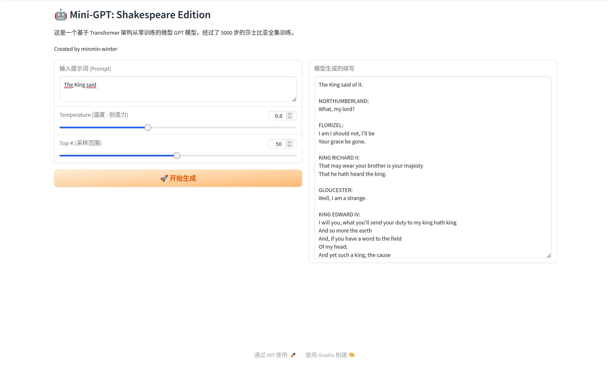

# 🤖 Mini-GPT: A Shakespearean Language Model

> An educational implementation of a GPT model, trained from scratch on the Tiny Shakespeare dataset.


## 📖 Overview

This project implements a Generative Pre-trained Transformer (GPT) **from scratch**. Unlike calling high-level APIs, I built the entire architecture layer-by-layer to understand the math behind LLMs.

The model generates text in the style of Shakespeare, featuring a **Gradio Web UI** for interactive temperature sampling.

## ✨ Features

* **Core Architecture**: Manual implementation of `Causal Self-Attention`, `Multi-Head Attention`, and `FeedForward` blocks.
* **Tokenizer**: Upgraded from character-level to **BPE (Byte Pair Encoding)** using OpenAI's `gpt-2` vocabulary.
* **Engineering**: Includes training checkpoints, logging, and robust file structure.
* **Visualization**: Real-time loss tracking and Web Demo.

## 📊 Training Results

* **Dataset**: Tiny Shakespeare
* **Training Steps**: 5000
* **Final Loss**: **2.78**
* **Device**: CPU (Training took about 2 hours)

### Loss Curve


## 🚀 Interactive Demo

I built a Web UI to visualize the generation process.

### Screenshot



### How to Run

1. **Install Dependencies**

    ```bash
    pip install -r requirements.txt
    ```

2. **Run the Web App**

    ```bash
    python app.py
    ```

    Open `http://127.0.0.1:7860` in your browser.

3. **Run CLI Inference**

    ```bash
    python inference.py
    ```

## 🧠 Core Learnings

Through this project, I mastered:
* The broadcasting mechanism in `Attention` calculation: $softmax(\frac{QK^T}{\sqrt{d_k}})V$.
* How `LayerNorm` and `Residual Connections` help gradients flow.
* The importance of `Temperature` and `Top-K` sampling in text generation.

---
*Created by minmin-winter*